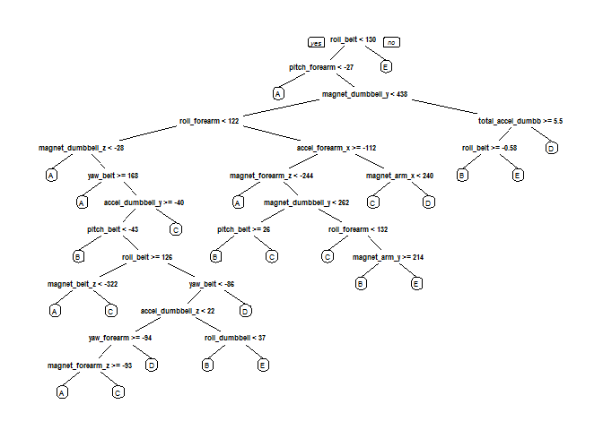

# Practical Machine Learning Assignment

## Background
Using devices such as Jawbone Up, Nike FuelBand, and Fitbit, it is now possible to collect a large amount of data about personal activity relatively inexpensively. These type of devices are part of the quantified self movement – a group of enthusiasts who take measurements about themselves regularly to improve their health, to find patterns in their behavior, or because they are tech geeks. However, what is lacking is that these people rarely quantify how well they perform a particular activity.

## Synopsis
This project investigates the quality of activities performed using data from accelerometers of the fitness devices placed on the belt, forearm, arm, and dumbbell of 6 participants. These participants were asked to perform one set of 10 repetitions of the Unilateral Dumbbell Biceps Curl in five different fashions:

* **Class A**: Exactly according to the specifications
* **Class B**: Throwing the elbows to the front
* **Class C**: Lifting the dumbbell only halfway
* **Class D**: Lowering the dumbbell only halfway
* **Class E**: Throwing the hips to the front

Based on the data obtained, the relevant features were examined to create a prediction model to predict the manner in which participants performed the Unilateral Dumbbell Biceps Curl through the `classe` variable.

This report covers aspects of how the prediction model was built and how cross-validation was used. In addition, it provides details of the out of sample error and explains the choices that the author made in deriving the solution.

## Data Processing
The training data can be downloaded [here](https://d396qusza40orc.cloudfront.net/predmachlearn/pml-training.csv), and the testing data can be downloaded [here](https://d396qusza40orc.cloudfront.net/predmachlearn/pml-testing.csv).

The following steps were taken to process the datasets:

* Load Required Libraries
* Download Training and Testing Datasets
* Load Training and Testing Datasets


```r
library(AppliedPredictiveModeling)
library(caret)
library(randomForest)
library(rattle)
library(rpart)
library(rpart.plot)
library(ggplot2)

dataDirectory <- "data"

trainingDataset <- file.path(dataDirectory, "pml-training.csv")
testingDataset <- file.path(dataDirectory, "pml-testing.csv")

if (!file.exists(trainingDataset)) {
  url <- "https://d396qusza40orc.cloudfront.net/predmachlearn/pml-training.csv"
  download.file(url, destfile = trainingDataset)
}
if (!file.exists(testingDataset)) {
  url <- "https://d396qusza40orc.cloudfront.net/predmachlearn/pml-testing.csv"
  download.file(url, destfile = testingDataset)
}

training <- read.csv("data/pml-training.csv", header = TRUE)
testing <- read.csv("data/pml-testing.csv", header = TRUE)
```


```r
dim(training)
```

```
## [1] 19622   160
```

```r
dim(testing)
```

```
## [1]  20 160
```

The next step was to select the appropriate features. Features without any missing values in the testing dataset are ideal candidates for the prediction model, i.e. **predictor candidates**.

Hence, we remove all columns that contain missing values.


```r
training <- training[,colSums(is.na(training)) == 0]
testing <- testing[,colSums(is.na(testing)) == 0]
```

Subsequently, we remove columns that do not contribute to the accelerometer measurements, such as `X`, `timestamp` and `window`.


```r
classe <- training$classe

removeColTraining <- grepl("^X|timestamp|window", names(training))
training <- training[, !removeColTraining]
trainingCleaned <- training[, sapply(training, is.numeric)]
trainingCleaned$classe <- classe

removeColTesting <- grepl("^X|timestamp|window", names(testing))
testing <- testing[, !removeColTesting]
testingCleaned <- testing[, sapply(testing, is.numeric)]
```

Finally, we perform data slicing by splitting the cleaned training dataset into a **pure training set (75%)** and a **validation dataset (25%)**. The training set allows us to train our model while the validation dataset allows us to conduct cross-validation to validate the accuracy of our training model.


```r
set.seed(3154)
inTrain <- createDataPartition(trainingCleaned$classe, p = 3/4, list = FALSE)
trainData <- trainingCleaned[inTrain,]
testData <- trainingCleaned[-inTrain,]
```

## Exploratory Data Analysis
A decision tree is plotted to better understand the impact of the various features on the `classe` variable.


```r
decisionTree <- rpart(classe ~ ., data = trainData, method = "class")
prp(decisionTree)
```

 

## Building a Predictive Model

The **Random Forest** algorithm was used because of the following reasons:

* **Random Forests require almost no input preparation.** They can handle binary features, categorical features, numerical features without any need for scaling.
* **Random Forests perform implicit feature selection** and provide a pretty good indicator of feature importance.
* **Random Forests are very quick to train.**

In addition, a **10-fold cross validation** was applied to the algorithm.


```r
randomForest <- trainControl(method = "cv", number = 10)
randomForestModel <- train(classe ~ ., data = trainData, method = "rf", trControl = randomForest, ntree = 250)
randomForestModel
```

```
## Random Forest 
## 
## 14718 samples
##    52 predictor
##     5 classes: 'A', 'B', 'C', 'D', 'E' 
## 
## No pre-processing
## Resampling: Cross-Validated (10 fold) 
## Summary of sample sizes: 13246, 13245, 13247, 13246, 13246, 13246, ... 
## Resampling results across tuning parameters:
## 
##   mtry  Accuracy   Kappa      Accuracy SD  Kappa SD   
##    2    0.9921186  0.9900298  0.002030349  0.002569172
##   27    0.9931379  0.9913195  0.002010184  0.002542345
##   52    0.9868867  0.9834113  0.003345983  0.004234441
## 
## Accuracy was used to select the optimal model using  the largest value.
## The final value used for the model was mtry = 27.
```

The accuracy of the trained model is approximately **99.3%**. This model was then applied to the validation dataset.


```r
predictionRandomForest <- predict(randomForestModel, testData)
confusionMatrix(testData$classe, predictionRandomForest)
```

```
## Confusion Matrix and Statistics
## 
##           Reference
## Prediction    A    B    C    D    E
##          A 1394    1    0    0    0
##          B    3  944    2    0    0
##          C    0    1  853    1    0
##          D    0    1    6  797    0
##          E    0    0    1    5  895
## 
## Overall Statistics
##                                           
##                Accuracy : 0.9957          
##                  95% CI : (0.9935, 0.9973)
##     No Information Rate : 0.2849          
##     P-Value [Acc > NIR] : < 2.2e-16       
##                                           
##                   Kappa : 0.9946          
##  Mcnemar's Test P-Value : NA              
## 
## Statistics by Class:
## 
##                      Class: A Class: B Class: C Class: D Class: E
## Sensitivity            0.9979   0.9968   0.9896   0.9925   1.0000
## Specificity            0.9997   0.9987   0.9995   0.9983   0.9985
## Pos Pred Value         0.9993   0.9947   0.9977   0.9913   0.9933
## Neg Pred Value         0.9991   0.9992   0.9978   0.9985   1.0000
## Prevalence             0.2849   0.1931   0.1758   0.1637   0.1825
## Detection Rate         0.2843   0.1925   0.1739   0.1625   0.1825
## Detection Prevalence   0.2845   0.1935   0.1743   0.1639   0.1837
## Balanced Accuracy      0.9988   0.9978   0.9945   0.9954   0.9993
```

Having applied the model to the validation dataset, we can now find out its true accuracy and out of sample error.


```r
accuracy <- postResample(predictionRandomForest, testData$classe)
accuracy
```

```
##  Accuracy     Kappa 
## 0.9957178 0.9945834
```

```r
oose <- 1 - as.numeric(confusionMatrix(testData$classe, predictionRandomForest)$overall[1])
oose
```

```
## [1] 0.004282219
```

The estimated true accuracy of the model is approximately **99.6%** and the estimated out of sample error is approximately **0.4%**.

## Testing Predictive Model against Testing Dataset

Finally, the trained predictive model was applied to the original testing dataset.


```r
finalResult <- predict(randomForestModel, testingCleaned[, -length(names(testingCleaned))])
finalResult
```

```
##  [1] B A B A A E D B A A B C B A E E A B B B
## Levels: A B C D E
```

## Submission to Coursera
The following function writes each of the final results for the 20 observations in the original testing dataset into one text file for submission on Coursera.


```r
pml_write_files = function(x){
  n = length(x)
  for(i in 1:n){
    filename = paste0("answers/problem_id_",i,".txt")
    write.table(x[i],file=filename,quote=FALSE,row.names=FALSE,col.names=FALSE)
  }
}

pml_write_files(finalResult)
```
